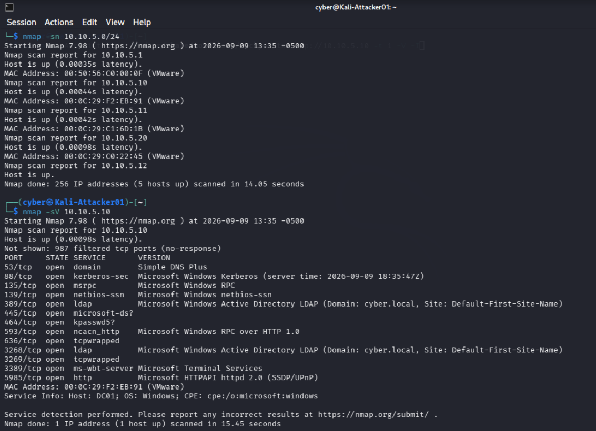

# Attack Chains

## Chain 1: RDP Brute Force

### Overview
This chain simulates a credential brute-force attack against a Remote Desktop 
Protocol (RDP) service exposed on a lab host, followed by detection of both the 
attempt and the resulting compromise via Wazuh. This maps to 
**MITRE ATT&CK T1110 (Brute Force)** and, where successful, **T1078 (Valid 
Accounts)** for the subsequent access.

**Attacker:** Kali Linux (`10.10.5.12`)
**Target:** Domain-joined host with RDP enabled (`10.10.5.10` DC01 or 
`10.10.5.11` Windows 10 client, depending on test run)
**Detection:** Wazuh Manager (`10.10.5.20`)

---

### Step 1 — Reconnaissance

A host discovery scan was run from Kali against the full lab subnet to enumerate 
live hosts before selecting a target using nmap. We can see the hosts that are 
up on the network:

\`\`\`bash
nmap -sn 10.10.5.0/24
\`\`\`

A targeted scan to initiate service discovery on the domain controller:
This is done to ensure port 3389 is open for brute forcing:
You could also scan just port 3389:

\`\`\`bash
nmap -sV 10.10.5.10 or nmap -p 3389 10.10.5.10
\`\`\`

---

### Step 2 — Brute force

Hydra was used to attempt authentication against the target's RDP service using 
the `rockyou.txt` wordlist against a known domain username:

\`\`\`bash
hydra -l dante -P /usr/share/wordlists/rockyou.txt rdp://10.10.5.11 -t 1 -V -I
\`\`\`

**Notes from execution:**
- The target account's password had been intentionally weakened for this test 
  (Default Domain Policy password complexity temporarily disabled, password set 
  to a value present in the `rockyou.txt` wordlist) to ensure the brute force 
  would succeed within a reasonable number of attempts.
- Domain authentication required specifying the domain explicitly during manual 
  connection testing (`xfreerdp ... /d:cyber.local`), since RDP clients default 
  to attempting local machine authentication rather than domain authentication 
  when no domain is specified.
- The target domain account required explicit membership in the local **Remote 
  Desktop Users** group on the client to permit RDP logon — domain users do not 
  receive this access by default.

Hydra successfully identified the correct credentials after a small number of 
attempts.

---

### Step 3 — Detection in Wazuh

The attack was visible in the Wazuh dashboard (**Threat Hunting → Events**) in 
two distinct stages:

**Failed authentication attempts:**
Each incorrect password guess generated a Windows Security Event (Logon Failure), 
surfaced by Wazuh as:

| Rule ID | Level | Description |
|---|---|---|
| 60122 | 5 | Logon Failure - Unknown user or bad password |

**Successful authentication:**
Immediately following the failed attempts, a successful logon event appeared, 
confirming the compromise:

- **Rule description:** Windows Workstation Logon Success
- **Logon type:** 10 (RemoteInteractive — consistent with an RDP session)
- **Source IP:** `10.10.5.12` (Kali)
- **Target account:** `dante`

This failure-then-success pattern — many authentication failures from a single 
source IP followed immediately by a successful logon from that same source — is 
a textbook brute-force compromise signature, and was detected using Wazuh's 
default ruleset with no custom rule authoring required.

---

### Observations
- Full event detail (source IP, logon type, target account) was present in the 
  underlying event data but not shown by default in Wazuh's summary table view — 
  it required expanding the individual event's full document/JSON view to surface.
- RDP's use of TLS for the connection meant credentials were never visible in 
  plaintext during a parallel Wireshark capture of the attack traffic; detection 
  relied entirely on host-based logon telemetry (via the Wazuh agent) rather than 
  network-layer payload inspection.