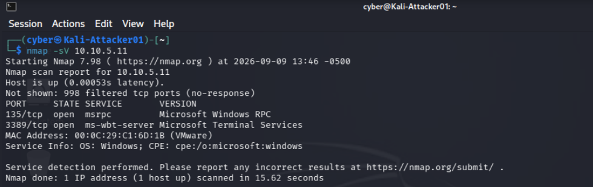
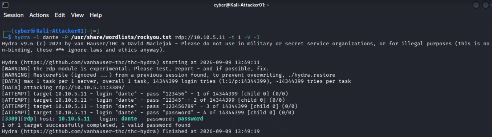
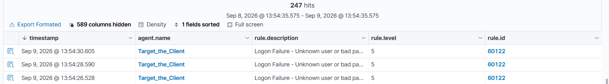
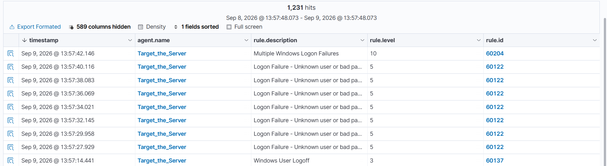
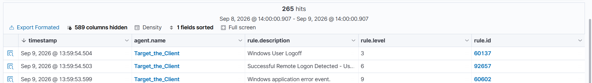
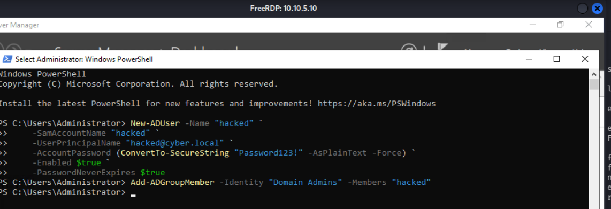
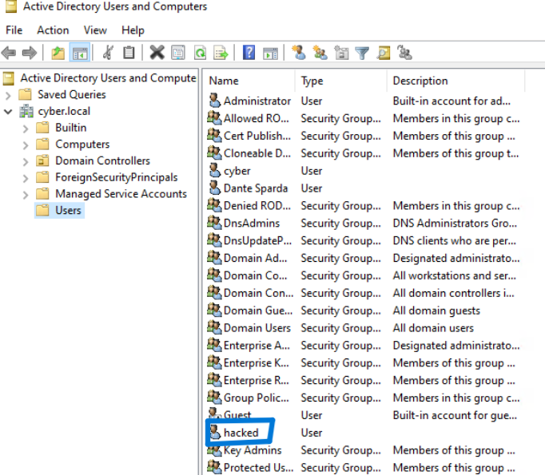
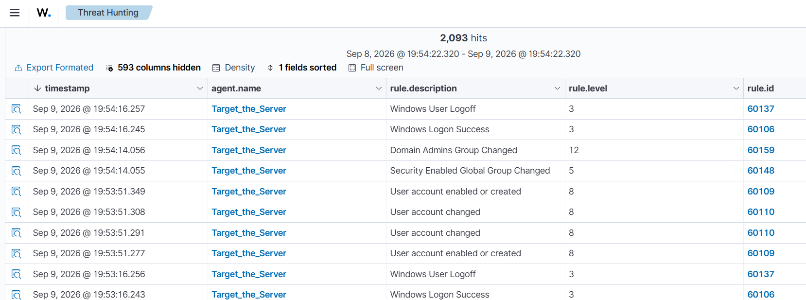

# Attack Chains

## Chain 1: RDP Brute Force

### Overview
This chain simulates a credential brute-force attack against a Remote Desktop 
Protocol (RDP) service exposed on a lab host, followed by detection of both the 
attempt and the resulting compromise via Wazuh. This maps to 
**MITRE ATT&CK T1110 (Brute Force)** and, where successful, **T1078 (Valid 
Accounts)** for the subsequent access.

**Attacker:** Kali Linux (`10.10.5.12`)
**Target:** Domain-joined host with RDP enabled (`10.10.5.10` DC01 or 
`10.10.5.11` Windows 10 client, depending on test run)
**Detection:** Wazuh Manager (`10.10.5.20`)

---

### Step 1 — Reconnaissance

A host discovery scan was run from Kali against the full lab subnet to enumerate 
live hosts before selecting a target using nmap. We can see the hosts that are 
up on the network:

\`\`\`bash
nmap -sn 10.10.5.0/24
\`\`\`

A targeted scan to initiate service discovery with the 
-sV flag on the domain controller.
This is done to ensure port 3389 is open for brute forcing.
You could also scan just port 3389:

\`\`\`bash
nmap -sV 10.10.5.10 or nmap -p 3389 10.10.5.10
\`\`\`

Another scan was initiated on the client. This information can be used to 
demonstrate the importance of secure passwords (the client has a less 
secure password than the server):

\`\`\`bash
nmap -sV 10.10.5.11
\`\`\`

---

### Step 2 — Brute force

Hydra was used to attempt authentication against the target's RDP service using 
the `rockyou.txt` wordlist against a known domain username. Rockyou can be un-
packed from the wordlists directory on Kali by default:

\`\`\`bash
hydra -l dante -P /usr/share/wordlists/rockyou.txt rdp://10.10.5.11 -t 1 -V -I
\`\`\`

**Notes from execution:**
- The target account's password had been intentionally weakened for this test 
  (Default Domain Policy password complexity temporarily disabled, password set 
  to a value present in the `rockyou.txt` wordlist) to ensure the brute force 
  would succeed within a reasonable number of attempts.
- Domain authentication required specifying the domain explicitly during manual 
  connection testing (`xfreerdp ... /d:cyber.local`), since RDP clients default 
  to attempting local machine authentication rather than domain authentication 
  when no domain is specified.
- The target domain account required explicit membership in the local **Remote 
  Desktop Users** group on the client to permit RDP logon — domain users do not 
  receive this access by default.

Hydra successfully identified the correct credentials after a small number of 
attempts.

This password was then used to connect to the client remotely with xfreerdp:

---

### Step 3 — Detection in Wazuh

The attack was visible in the Wazuh dashboard (**Threat Hunting → Events**) in 
two distinct stages:

**Failed authentication attempts:**
Each incorrect password guess generated a Windows Security Event (Logon Failure), 
surfaced by Wazuh as seen here:

The same attack was performed on the server, which has a more secure password,
generating even more logs:

**Successful authentication:**
Immediately following the failed attempts, a successful logon event appeared, 
confirming the compromise:

This failure-then-success pattern — many authentication failures from a single 
source IP followed immediately by a successful logon from that same source — is 
a textbook brute-force compromise signature, and was detected using Wazuh's 
default ruleset with no custom rule authoring required.

---

### Observations
- Full event detail (source IP, logon type, target account) was present in the 
  underlying event data but not shown by default in Wazuh's summary table view — 
  it required expanding the individual event's full document/JSON view to surface.
- RDP's use of TLS for the connection meant credentials were never visible in 
  plaintext during a parallel Wireshark capture of the attack traffic; detection 
  relied entirely on host-based logon telemetry (via the Wazuh agent) rather than 
  network-layer payload inspection.

  ---

## Chain 2: Privilege Escalation via Domain Admin Account Creation

### Overview
This chain simulates a post-compromise persistence/privilege escalation action, 
where an attacker who has already obtained valid domain credentials (via the RDP 
brute force documented in Chain 1) uses that access to create a new, fully 
privileged account — establishing a durable foothold independent of the originally 
compromised user. This maps to **MITRE ATT&CK T1136.002 (Create Account: Domain 
Account)** and **T1098 (Account Manipulation)**.

**Attacker:** Kali Linux (`10.10.5.12`), connected via RDP to DC01
**Target:** Domain Controller — DC01 (`10.10.5.10`)
**Detection:** Wazuh Manager (`10.10.5.20`)

---

### Step 1 — Remote access to the Domain Controller

Using `xfreerdp` from Kali, an RDP session was established directly against 
DC01:

\`\`\`bash
xfreerdp /v:10.10.5.10 /u:administrator /d:cyber.local /p:'<password>' /cert:ignore
\`\`\`

This simulates a scenario where an attacker has escalated from an initial 
foothold (e.g., the compromised standard user from Chain 1) to direct access on 
the domain controller itself — the highest-value target in the environment.

---

### Step 2 — Create a new domain account

From within the RDP session, PowerShell was used to create a new domain user 
account:

\`\`\`powershell
New-ADUser -Name "hacked" `
    -SamAccountName "hacked" `
    -UserPrincipalName "hacked@cyber.local" `
    -AccountPassword (ConvertTo-SecureString "Password123!" -AsPlainText -Force) `
    -Enabled $true `
    -PasswordNeverExpires $true
\`\`\`

---

### Step 3 — Escalate the new account to Domain Admins

The newly created account was then added to the **Domain Admins** group, granting 
it full administrative control over the domain:

\`\`\`powershell
Add-ADGroupMember -Identity "Domain Admins" -Members "hacked"
\`\`\`

Membership was confirmed with:

\`\`\`powershell
Get-ADGroupMember -Identity "Domain Admins"
\`\`\`

The hacked account can be view in AD Users & Computers on DC01:

---

### Step 4 — Detection in Wazuh

Both actions generated corresponding Windows Security Events, forwarded by the 
DC01 agent and surfaced in the Wazuh dashboard (**Threat Hunting → Events**):

Both events were captured using Wazuh's default ruleset with no custom rule 
authoring required, and included full subject/target account detail once the 
underlying event's full document view was expanded. If a SOC analyst were to 
see this in a real environment, it would immediately take top priority. In 
addition to being used as means for privilege escalation, this rogue account 
can also be used as a backdoor for an attacker.

---

### Observations
- This chain represents a meaningfully higher-severity scenario than Chain 1 
  alone: rather than just detecting unauthorized access, Wazuh captured the 
  attacker's follow-on action of establishing a second, fully privileged 
  identity — a common real-world persistence technique used to survive 
  password resets or account lockouts on the originally compromised credential.
- In a production environment, an alert on **any** addition to the Domain Admins 
  group is typically treated as a critical-severity event warranting immediate 
  investigation, given how few legitimate changes to that group should occur 
  outside of planned administrative activity.
- Combined, Chain 1 and Chain 2 demonstrate a full initial-access-to-domain- 
  compromise narrative, with detection coverage at each stage: brute-force 
  attempt, successful unauthorized logon, and privilege escalation.