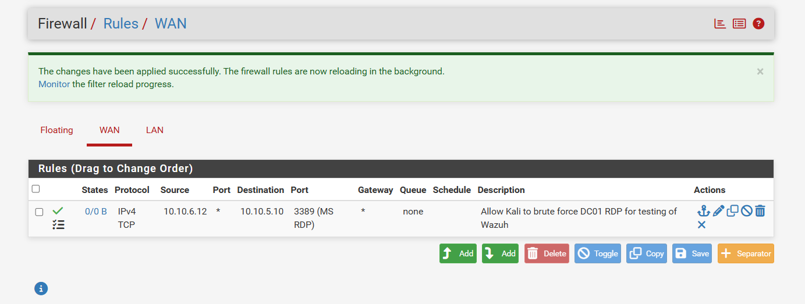
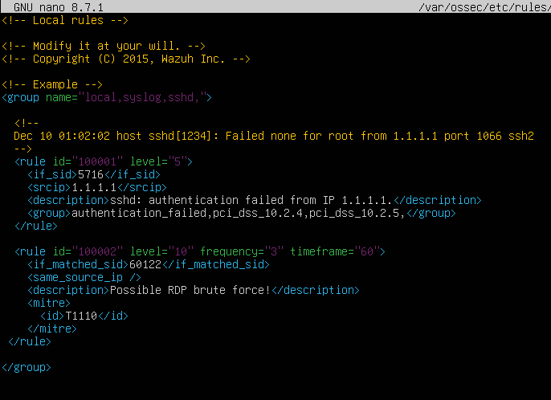
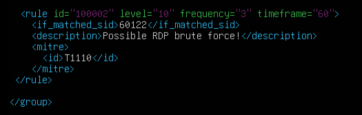
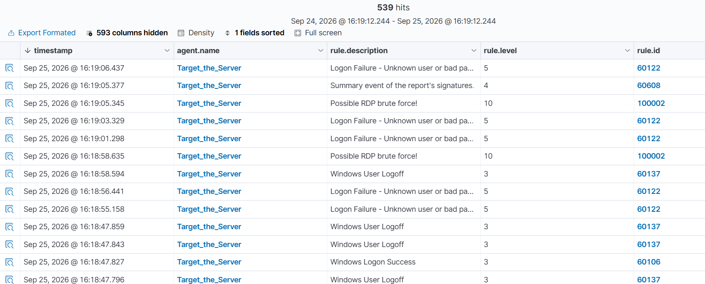

# Custom Detection Rules — Wazuh

## Overview

This document covers the creation of a custom correlation rule in Wazuh, going 
beyond the default ruleset to build a rule specifically tailored to the RDP 
brute-force scenario documented in [Attack Chains](attack-chains.md). It also 
covers the firewall changes required to re-enable that attack path following 
the pfSense segmentation work in 
[Firewall Addition](firewall-addition.md), and the troubleshooting involved in 
getting the custom rule to actually fire.

## Goal

Wazuh's default ruleset already detects individual failed RDP logon attempts 
(rule 60122, level 5) and successful logons (rule 60106), as shown in earlier 
testing. The goal here was to go a step further and build a **correlation 
rule** — one that specifically identifies a brute-force *pattern* (multiple 
failures from the same source in a short window) as a single, higher-severity 
alert, rather than relying on an analyst to manually notice a cluster of 
individual level-5 events.

## Step 1: Re-enabling the attack path through pfSense

With Kali now segmented onto its own subnet behind pfSense (see 
[Firewall Addition](firewall-addition.md)), the RDP brute-force attack could 
no longer reach the Windows targets by default. Two changes were required on 
the firewall before the attack chain could be re-tested:

1. **Interfaces → WAN → Reserved Networks:** both "Block private networks and 
   loopback addresses" and "Block bogon networks" were unchecked. pfSense 
   treats any private-range (RFC1918) source address arriving on WAN as 
   suspicious by default, which incidentally blocked all of Kali's traffic 
   since Kali's address (`10.10.6.12`) is itself a private IP — a lab-specific 
   quirk of using private addressing on both sides of the firewall.
2. **Firewall → Rules → WAN:** a narrow pass rule was added, permitting TCP 
   port 3389 (RDP) from Kali (`10.10.6.12/32`) to DC01 (`10.10.5.10/32`) only. 
   Logging was enabled on the rule for visibility.

With these changes in place, `nmap -Pn -p 3389 10.10.5.10` from Kali confirmed 
the port was reachable. The `-Pn` flag was required because ICMP (ping) 
remained blocked — only the explicitly permitted RDP port was passable, which 
is the intended behavior of a narrow, least-privilege rule rather than a 
blanket allow.

## Step 2: Writing the custom rule

Custom Wazuh rules are defined in `/var/ossec/etc/rules/local_rules.xml` on 
the Wazuh manager. The following rule was added inside the existing 
`<group>` block:

**Logic:**
- `if_matched_sid` — triggers based on the existing "Logon Failure" rule 
  (60122) rather than matching raw logs directly
- `frequency="3"`, `timeframe="60"` — requires 3 matches of rule 60122 within 
  a 60-second window before this rule fires
- `same_source_ip` — intended to require all 3 matches to originate from the 
  same source IP, distinguishing a real brute-force pattern from unrelated 
  failures
- `level="10"` — a meaningfully higher severity than the base rule's level 5
- `<mitre><id>T1110</id></mitre>` — ties the rule to MITRE ATT&CK's Brute 
  Force technique

After saving the file, the Wazuh manager service was restarted to load the 
new rule:

\`\`\`bash
sudo systemctl restart wazuh-manager
sudo systemctl status wazuh-manager
\`\`\`

The service came up clean with no errors, confirming the rule's XML was 
syntactically valid.

## Step 3: Re-running the attack

With the firewall rule in place and the RDP port confirmed reachable, the 
brute-force attack from [Attack Chains, Chain 1](attack-chains.md) was 
re-executed from Kali against DC01:

\`\`\`bash
hydra -l administrator -P /usr/share/wordlists/rockyou.txt rdp://10.10.5.10 -t 1 -V -I
\`\`\`

The Wazuh dashboard confirmed the attack was visible end-to-end: a long run of 
"Logon Failure - Unknown user or bad password" events (rule 60122), followed 
by a "Windows Logon Success" event (rule 60106) once the correct password was 
found.

## Step 4: Custom rule did not fire — investigation

Despite the failure events occurring well within the rule's 60-second/3-count 
threshold, no alert for rule 100002 appeared in the dashboard when searching 
`rule.id: 100002`.

**Root cause:** inspecting the full JSON document of an individual 60122 alert 
showed no populated `data.srcip` field. Wazuh's `same_source_ip` directive 
relies on this field being present in the alert data to compare across events; 
without it, the correlation has nothing to match against and the rule can 
never fire, regardless of whether the timing and frequency conditions were 
actually met. This is a known inconsistency in Wazuh's default decoders — some 
Windows event types populate a standard `srcip` field, others (including this 
RDP logon failure event) do not.

## Resolution options identified

Two paths forward were identified to address the missing source-IP field:

1. **Reference the actual field name directly**, if the source IP exists under 
   a different path in the raw event data (e.g., 
   `data.win.eventdata.ipAddress`, a common location for this data in Windows 
   Security/Sysmon events), using `<same_field>` in place of 
   `<same_source_ip />`.
2. **Drop the source-IP correlation entirely**, counting any 3 failures within 
   60 seconds regardless of source. Less precise in a multi-attacker 
   environment, but functionally equivalent in this single-attacker lab 
   scenario, and an honest tradeoff to document rather than obscure.

The logs in the SIEM can be viewed as intended:

## Observations

- A rule that is syntactically valid and loads without error is not the same 
  as a rule that behaves correctly — validating that referenced fields are 
  actually populated in real alert data is a necessary step that a clean 
  service restart alone does not confirm.
- This is a realistic example of the kind of decoder/field-mapping gap 
  detection engineers regularly encounter when writing correlation rules 
  against a SIEM's default parsing, rather than a mistake specific to this 
  lab's setup.
- The firewall changes required to re-enable this attack path — disabling 
  automatic private-network protections and adding one narrow, logged pass 
  rule — reinforce the least-privilege principle discussed in 
  [Firewall Addition](firewall-addition.md): only the specific service needed 
  for testing was opened, not a blanket allow from the attacker segment.