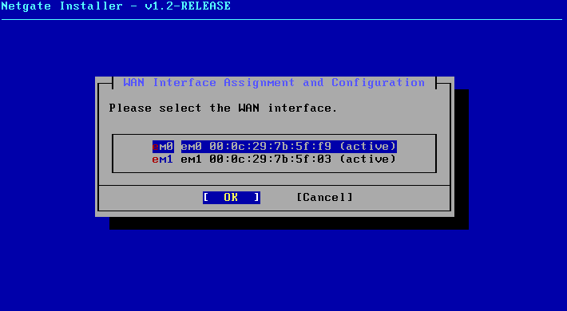
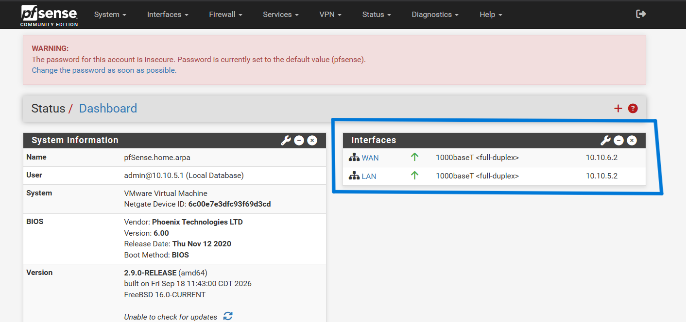
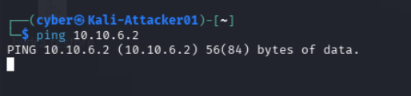
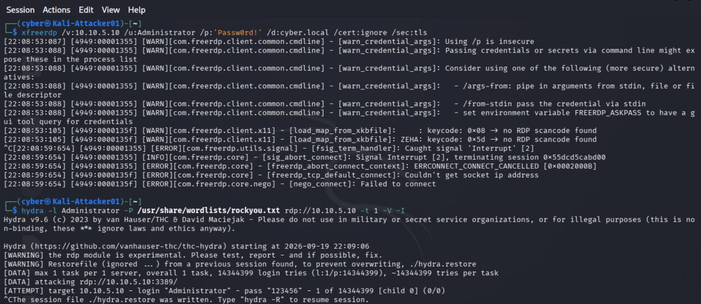
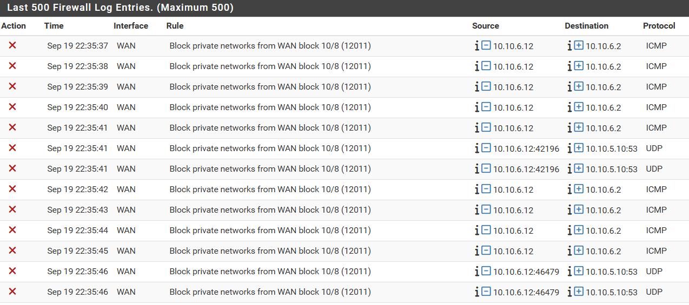

# Firewall Addition — pfSense

## Overview

This document covers the addition of a pfSense firewall to the lab, introduced 
to provide actual network-layer segmentation between the attacker system and 
the rest of the environment, rather than relying solely on VMware's host-only 
network isolation. Prior to this addition, Kali sat on the same flat subnet 
(`10.10.5.0/24`) as DC01, the Windows 10 client, and the Wazuh manager, with no 
enforcement point between attacker and victims beyond the network being 
isolated from the host's home LAN.

## Goal

The objective was to place a firewall between the attacker (Kali) and the 
protected lab segment (DC01, client, Wazuh), allowing:
- Explicit firewall rule enforcement between the two zones, rather than relying 
  on implicit flat-network isolation
- A foundation for future network-layer detection (e.g., Suricata/Snort as a 
  pfSense package) to complement the existing host-based detection provided by 
  Wazuh
- A more realistic representation of a segmented enterprise network, where an 
  attacker on an external or DMZ-facing segment must traverse a firewall to 
  reach internal hosts

## Topology change

A new host-only network was created through VMware to isolate the attacker 
from the protected segment, with pfSense acting as the router/firewall between them:

| Network | VMnet | Subnet | Hosts |
|---|---|---|---|
| Protected (LAN) | VMnet15 | `10.10.5.0/24` | DC01, Windows 10 client, Wazuh manager, pfSense LAN |
| Attacker (WAN) | VMnet16 | `10.10.6.0/24` | Kali, pfSense WAN |

This also more accurately reflects a real enterprise environment, where 
machines used by employees would be isolated from outside.

DHCP was disabled on both VMnets, consistent with the rest of the lab's 
manually-assigned static addressing scheme.

## pfSense VM specifications

- **Software:** pfSense Community Edition 2.9.0-RELEASE (installed via the 
  Netgate installer image)
- **Resources:** 2 vCPUs, 512MB RAM, 8GB dynamically-allocated virtual disk
- **Network adapters:** two virtual NICs — one on VMnet15 (LAN), one on 
  VMnet16 (WAN)

Both NICs can be seen during the pfSense configuration:

### Interface configuration
- **LAN:** `10.10.5.2/24`
- **WAN:** `10.10.6.2/24`, no upstream gateway (isolated segment, not a real 
  internet uplink)

pfSense rules are managed through the webConfigurator hosted through https:

Both interfaces can be seen on the main page of the pfSense webConfigurator:

Both interfaces were originally assigned the conventional `.1` address on 
their respective subnets, but this collided with VMware's own host-only virtual 
adapters, which had already claimed `10.10.5.1` and `10.10.6.1` on those same 
subnets. This was identified by observing that ping to the firewall's LAN 
address succeeded while a TCP connection to the web GUI on port 443 did not — 
the ping was actually being answered by the host machine itself, not pfSense, 
since both devices shared the same address. Both interfaces were reassigned to 
`.2` to resolve the conflict.

## Current state: default-deny in effect

With no custom firewall rules yet defined, pfSense's default WAN policy applies: 
all inbound traffic to the WAN interface is implicitly denied, with no rule 
present in **Firewall → Rules → WAN** to permit it. This was confirmed as 
follows:

- **pfSense → Kali:** a ping from the pfSense console to Kali's address 
  (`10.10.6.12`) succeeded, confirming the WAN interface itself is correctly 
  configured and reachable outbound.

- **Kali → pfSense:** a ping from Kali to pfSense's WAN address (`10.10.6.2`) 
  failed, consistent with pfSense's default-deny WAN policy silently dropping 
  unsolicited inbound ICMP.

- **RDP brute force re-attempt:** with Kali now sitting behind the firewall on 
  the WAN-side segment, the RDP brute-force attack from 
  [Attack Chains, Chain 1](attack-chains.md) was re-attempted against the 
  Windows 10 client (`10.10.5.11`). The attempt did not reach the target at 
  all — Hydra was unable to establish any connection to the RDP service, since 
  the traffic never crossed the firewall.
- **Manual RDP connection re-attempt:** a manual `xfreerdp` connection attempt 
  from Kali to the same target was likewise blocked, confirming the failure 
  was due to the firewall's default policy rather than an issue specific to 
  Hydra. Both attempts can be seen as failed below:

In the webConfigurator, going to Status -> System Logs -> Firewall will pull
up the firewall logs of recent events. The failed ping attempts and connection
attempts from Kali can be seen. The entries with ICMP as the protocol are the 
ping attempts, and the UDP entries are attempted connections to DC01.

The default implicit deny rule can be seen under the "Rule" column as well.

This confirms the firewall is functioning as intended: traffic originating 
from the attacker segment cannot reach the protected LAN without an explicit 
rule permitting it. No such rule currently exists, meaning the attack chains 
documented earlier in this lab are no longer reproducible from Kali's current 
position without first defining a firewall rule to allow the relevant traffic 
through.

## Next steps

- Define a narrow, intentional firewall rule (e.g., permitting only RDP traffic 
  from Kali to the client) to re-enable a controlled version of the attack 
  chain, representing a more realistic scenario where an attacker has found a 
  single exposed service through an otherwise restrictive firewall
- Evaluate adding Suricata or Snort as a pfSense package for network-layer 
  intrusion detection, to complement the existing host-based detection 
  provided by Wazuh