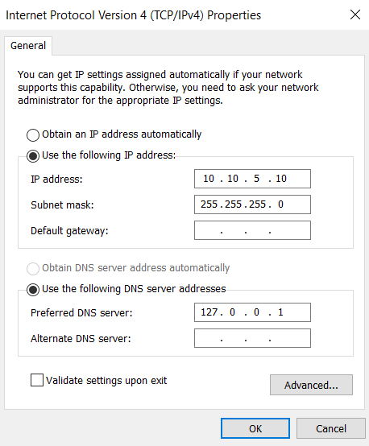
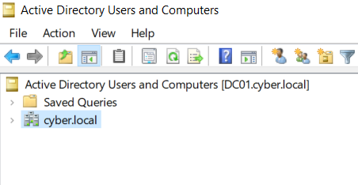
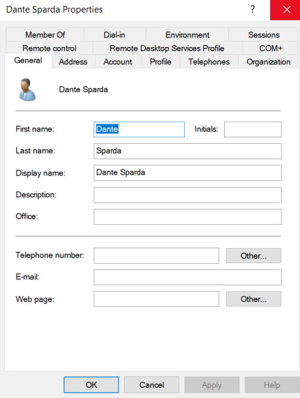
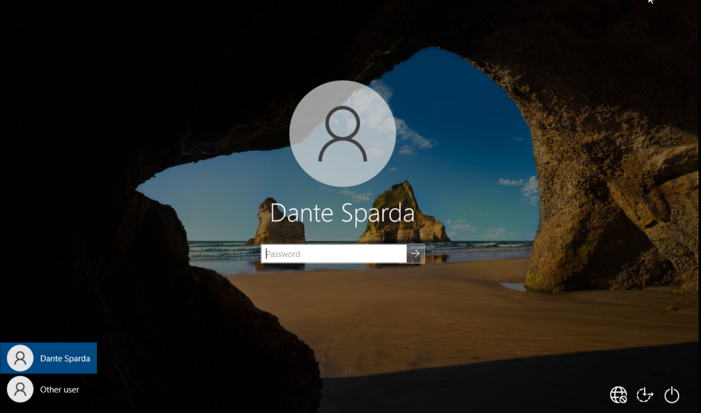
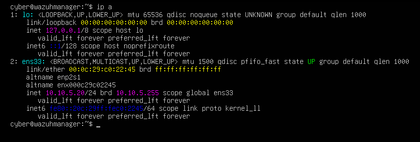
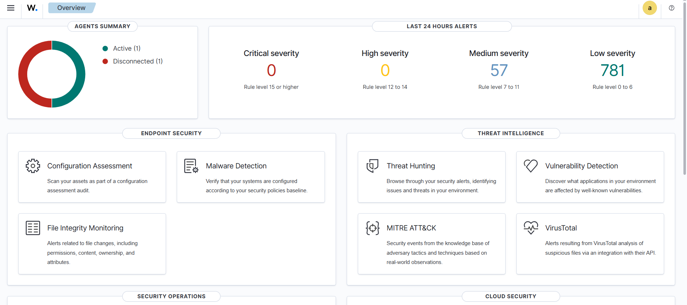
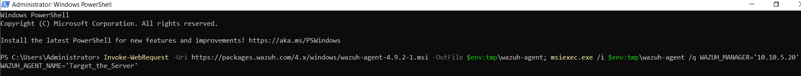
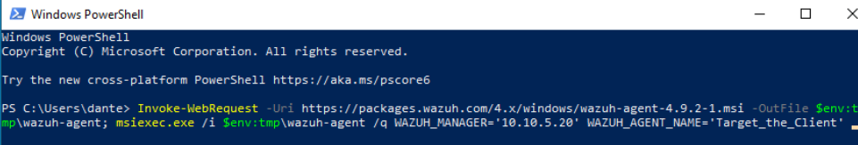
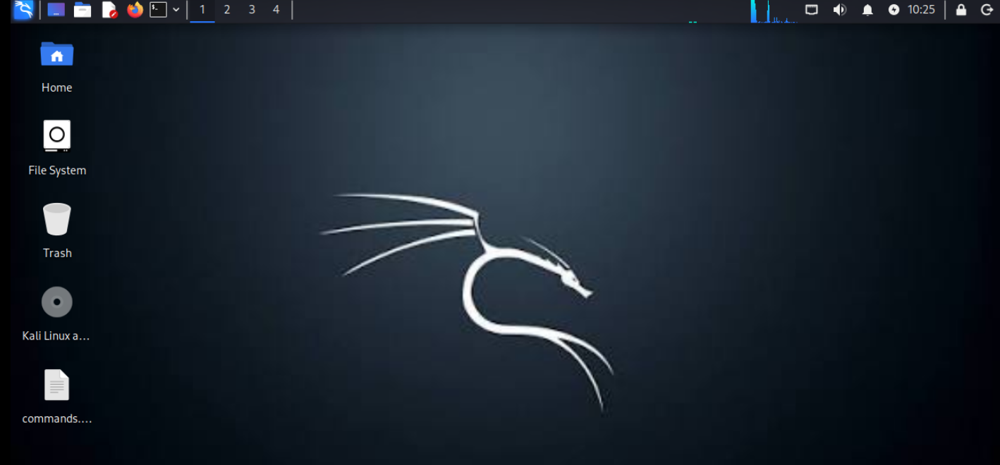

# Lab Setup

## Overview

This document details the build-out specifications of my self-hosted Active 
Directory and SIEM lab, 
designed to simulate a small enterprise network for offensive/defensive security 
practice. The lab was built entirely on a single laptop using VMware Workstation Pro, 
with all virtual machines isolated on a dedicated host-only network segment.

The goal of this lab was to gain hands-on experience with:
- Active Directory Domain Services (AD DS) deployment and administration
- Windows domain-joined client management
- Offensive tooling (Kali Linux, Hydra) against a realistic target
- SIEM deployment and log ingestion (Wazuh)
- End-to-end detection engineering — building an attack, then verifying it's caught

**Lab topology:**
| Role | OS | Static IP |
|---|---|---|
| Domain Controller (DC01) | Windows Server 2022 Standard | `10.10.5.10` |
| Domain Client | Windows 10 Enterprise | `10.10.5.11` |
| SIEM (Wazuh Manager) | Ubuntu Server 24.04 | `10.10.5.20` |
| Attacker | Kali Linux | `10.10.5.12` |

All VMs run on VMware Workstation Pro, connected to a dedicated host-only virtual 
network (VMnet15, subnet `10.10.5.0/24`), isolated from the host machine's home 
network to prevent any lab traffic from leaking onto the physical LAN.

---

## Domain Controller — DC01 (Windows Server 2022)

### Base install
- **OS:** Windows Server 2022, Standard edition, Desktop Experience (GUI enabled 
  for administration convenience — Server Core was considered but skipped in favor 
  of easier AD DS/DNS management for this build)
- **Resources:** 2 vCPUs, 4GB RAM, 25GB dynamically-allocated virtual disk (NVMe 
  controller, single-file VMDK)
- **Networking:** VMware Workstation host-only adapter (VMnet15), isolated from 
  the physical host network

### Networking configuration
DC01 was assigned a static IP prior to promotion, since domain controllers require 
stable addressing:
- **IP:** `10.10.5.10` / `255.255.255.0`
- **DNS:** `127.0.0.1` (self-referential, since DC01 also hosts the DNS role)
- **Gateway:** none — all lab hosts sit on the same subnet, so no routing is required

### Active Directory Domain Services promotion
The server was promoted to a domain controller via Server Manager, standing up a 
new forest and domain:
- **Domain:** `cyber.local`
- **NetBIOS name:** `CYBER`
- AD DS and DNS server roles were installed together, with DNS delegation warnings 
  during promotion safely ignored (expected behavior for an isolated lab with no 
  parent DNS zone)
- A DSRM (Directory Services Restore Mode) password was set for recovery purposes

### Post-promotion hardening/cleanup
- The default password complexity policy (Default Domain Policy) initially blocked 
  promotion due to a non-compliant local Administrator password; this was resolved 
  by resetting the local Administrator password to meet complexity requirements 
  before retrying promotion
- Verified promotion success via `dcdiag` and by confirming `whoami` returned 
  `cyber\administrator`
- Remote Desktop was enabled on DC01, with the built-in Administrator account 
  added where needed for lab access
- Default Domain Policy password complexity was later temporarily disabled to 
  support controlled weak-password testing (see [Attack Chains](attack-chains.md))

### Role in the lab
DC01 serves as the authoritative domain controller for `cyber.local`, providing 
authentication (Kerberos/NTLM) and DNS resolution for all domain-joined hosts. It 
also functions as a monitored endpoint, running a Wazuh agent to forward Windows 
Security Event Log data (logon successes/failures, group membership changes) to 
the SIEM for detection testing.

---

## Domain Client — Windows 10 Enterprise

### Base install
- **OS:** Windows 10 Enterprise Evaluation (chosen over Home/Pro for full Group 
  Policy and audit-policy compatibility with the domain environment; no license 
  key required for the evaluation build)
- **Resources:** 2 vCPUs, 4GB RAM, dynamically-allocated virtual disk
- **Networking:** VMware Workstation host-only adapter (VMnet15), same subnet as 
  DC01

### Initial setup
- A local account was created during OOBE setup for initial configuration access
- Windows Defender Firewall's default ICMP block was identified and resolved 
  (inbound ping was disabled by default, causing early connectivity troubleshooting 
  during host discovery testing from Kali)

### Networking configuration
- **IP:** `10.10.5.11` / `255.255.255.0`
- **DNS:** `10.10.5.10` (points to DC01, required for the client to resolve 
  `cyber.local` and locate the domain controller)
- **Gateway:** none — same flat subnet as the rest of the lab

### Domain join
The client was joined to `cyber.local` via System Properties, authenticating with 
domain administrator credentials (`CYBER\Administrator`). Once joined, the machine 
appeared under **Active Directory Users and Computers → Computers** on DC01.

### Domain user account
A standard (non-privileged) domain user, **Dante**, was created in Active Directory 
to serve as the "normal user" account for this machine — used both for realistic 
day-to-day telemetry generation and as the target account for the attack scenario 
documented in [Attack Chains](attack-chains.md). Dante was added to the local 
**Remote Desktop Users** group on the client to permit RDP logons, since domain 
users do not have RDP access by default.

### Remote access configuration
Remote Desktop (RDP, port 3389) was enabled to support both legitimate remote 
administration and the planned attack simulation. Network Level Authentication 
(NLA) was disabled during testing to resolve a FreeRDP/Hydra compatibility issue 
encountered from the Kali attacker VM (see [Attack Chains](attack-chains.md) for 
details).

### Role in the lab
The Windows 10 client represents a standard end-user workstation within the domain 
— the most realistic target for credential-based attacks in a real environment, 
since attackers typically target regular users rather than domain controllers 
directly. It runs a Wazuh agent to forward Security Event Log data (logon attempts, 
local group membership changes) to the SIEM.

---

## SIEM — Wazuh Manager (Ubuntu Server)

### Base install
- **OS:** Ubuntu Server 24.04 LTS (non-minimized install, to retain standard 
  utilities needed by the Wazuh installer)
- **Resources:** 4 vCPUs (2 processors × 2 cores), 4GB RAM, virtual disk expanded 
  from an initial 15GB to 45GB after early space constraints during the Wazuh 
  install (LVM volume extended live via `growpart`, `pvresize`, `lvextend`, and 
  `resize2fs` without requiring a reinstall)
- **Networking:** VMware Workstation host-only adapter (VMnet15) for normal 
  operation; temporarily switched to NAT during installation/updates to allow 
  outbound internet access for package downloads

### Installation
Wazuh was deployed using the official all-in-one quickstart installer, bundling 
the Wazuh manager, indexer (OpenSearch), and dashboard components on a single host:

\`\`\`bash
curl -sO https://packages.wazuh.com/4.9/wazuh-install.sh
sudo bash ./wazuh-install.sh -a
\`\`\`

The installer generates and displays admin credentials for the web dashboard on 
completion; these were retrieved from the installer's saved output 
(`wazuh-install-files/wazuh-passwords.txt`) rather than relying on terminal 
scrollback.

### Networking configuration
- **IP:** `10.10.5.20` / `255.255.255.0`, configured statically via netplan 
  after installation
- **DNS:** `10.10.5.10` (DC01)
- **Gateway:** none — same flat subnet as the rest of the lab

Internet access (required only for the initial package download) was provided by 
temporarily switching the VM's network adapter to NAT, then reverting to the 
host-only VMnet15 adapter once installation completed, to keep the SIEM on the 
same isolated segment as the rest of the lab for agent communication.

### Dashboard access
The Wazuh web dashboard is accessible from the host machine's browser at 
`https://10.10.5.20`, authenticating with the credentials generated at install 
time. The dashboard uses a self-signed certificate by default, resulting in an 
expected browser trust warning on first connection.

### Agent deployment
Wazuh agents were deployed to both DC01 and the Windows 10 client using the 
dashboard's built-in agent deployment wizard (**Agents → Deploy new agent**), 
which generates a per-host PowerShell install command pointing at the manager's 
IP (`10.10.5.20`). Since agent installation requires downloading the Windows 
agent package from `packages.wazuh.com`, each Windows VM was temporarily switched 
to NAT for the download/install step, then reverted to its static host-only 
configuration before starting the agent service:

\`\`\`powershell
NET START WazuhSvc
\`\`\`

Agent connectivity was verified via the dashboard's **Agents** view, confirming 
an **Active** status for each host.

### Role in the lab
The Wazuh manager serves as the central log aggregation and detection point for 
the lab, ingesting Windows Security Event Log data from DC01 and the client. Its 
default ruleset — without any custom rule authoring — was sufficient to detect 
the RDP brute-force and subsequent privilege escalation activity documented in 
[Attack Chains](attack-chains.md).

---

## Attacker — Kali Linux

### Base install
- **OS:** Kali Linux (standard install)
- **Resources:** 2 vCPUs, 2GB RAM, dynamically-allocated virtual disk
- **Networking:** VMware Workstation host-only adapter (VMnet15), same subnet as 
  the rest of the lab

### Networking configuration
- **IP:** `10.10.5.12` / `255.255.255.0`, configured statically via `netplan` 
  (Kali's default `eth0` interface)
- **DNS:** `10.10.5.10` (DC01)
- **Gateway:** none — same flat subnet as the rest of the lab

Kali was kept isolated on the host-only network by default and only temporarily 
switched to NAT when internet access was needed (e.g., updating tools or 
wordlists), reverting to the static host-only configuration for all attack 
activity.

### Tooling
No additional installation was required beyond Kali's default toolset:
- **nmap** — host discovery and port scanning across the lab subnet
- **Hydra** — credential brute-forcing against RDP
- **xfreerdp** — manual RDP connection testing, used to validate connectivity 
  and authentication independently of Hydra during troubleshooting

### Role in the lab
Kali served as the sole attacker platform, used to enumerate the lab subnet, 
identify the domain-joined Windows client as a target, and execute the RDP 
brute-force and post-compromise activity documented in 
[Attack Chains](attack-chains.md).